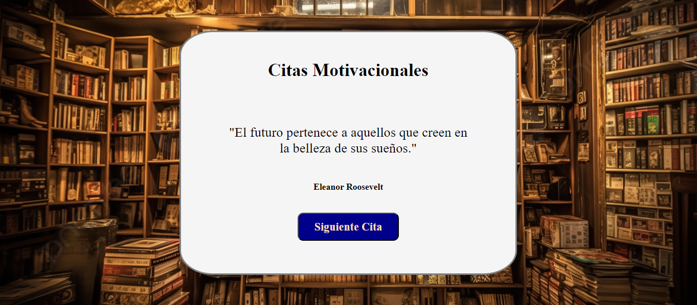

# citas-aleatorias
Este repositorio contiene una colección de citas aleatorias y motivadoras, perfectas para inspirarte y animarte a lo largo del día. Contiene citas de diversos autores, desde filósofos y líderes hasta deportistas y artistas. El repositorio incluye una interfaz web simple y atractiva para mostrar las citas. ¡Disfrutalo!

Interfaz: 

Tecnologías utilizadas:

=> HTML: Para la estructura del contenido web
=> CSS: Para el diseño y la presentación de las citas.
=> JavaScript: Para la funcionalidad de generación aleatoria de citas.

Contribuciones:

Se alienta a otros usuarios a contribuir a este proyecto agregando nuevas citas, traduciendo el repositorio a otros idiomas o sugiriendo mejoras en la interfaz web.
